## markdown_note

> One place for learning Markdown from novice to proficient, this tutorial will continue to update.

---
[TOC]

### Markdown 从入门到精通

---

> Markdown 语法各平台和工具略有不同，此处以 [Typora](https://www.typora.io/ "Typora") 为准。
> [《常用软件网站推荐》](/archives/6f958ce8.html) 一文中，`写作工具推荐` 中有提到 推荐 Markdown，也提到 [Typora](/2018/10/15/022_software_recommened/)。
> 这里对 Markdwon 的使用语法做一个系统和详细的介绍，相信可以帮助你快速掌握。
>
> 友情提示：此文稍长，建议边看边操作。

---

#### 1. 分级标题
##### 2.1 写法-1
###### 2.1.1 代码
```
一级标题
===

二级标题
---
```
###### 2.1.2 效果


##### 2.2 写法-2
###### 2.2.1 代码
```
# 一级标题
## 二级标题
### 三级标题
#### 四级标题
##### 五级标题
###### 六级标题
```
###### 2.2.2 效果
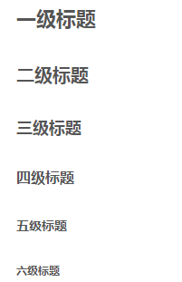


#### 2. 斜体或粗体

##### 2.1 代码
```
*斜体*或_斜体_
**粗体**
***加粗斜体***
~~删除线~~
```
##### 2.2 效果
*斜体* 或 _斜体_
**粗体**
***加粗斜体***
~~删除线~~


#### 3. 表格的使用

> 注意对齐方式：左对齐 `:------`，居中 `:------:`, 右对齐 `------:`。

##### 3.1 代码
```
| 序号     | 年份     | 累计记账条数 | 备注     |
| :------: | :------: | :------:     | :------: |
| -        | 总计     | 8700         | 截至 201 |
| 1        | 2011     | 1025         | 无       |
| 2        | 2012     |  737         | 无       |
| 3        | 2013     |  812         | 无       |
```
##### 3.2 效果

| 序号     | 年份     | 累计记账条数 | 备注     |
| :------: | :------: | :------:     | :------: |
| -        | 总计     | 8700         | 截至 201 |
| 1        | 2011     | 1025         | 无       |
| 2        | 2012     |  737         | 无       |
| 3        | 2013     |  812         | 无       |


#### 4. 分隔线
> 语法说明：**三个级以上的** `*、-、__`

##### 4.1 代码
```
* * *
***
*****
- - -
_ _ _

-----
```

##### 4.2 效果都一样
_ _ _


#### 5. 列表

##### 5.1 无序列表
> 使用 `*，+，-` 表示无序列表。

###### 5.1.1 代码
```
- 西瓜
- 苹果
- 黄瓜
```

###### 5.1.2 效果
- 西瓜
- 苹果
- 黄瓜

##### 5.2 有序列表

###### 5.2.1 代码
```
1. 西瓜
2. 苹果
3. 黄瓜
```

###### 5.2.2 效果
1. 西瓜
2. 苹果
3. 黄瓜

##### 5.3 定义型列表

###### 5.3.1 代码
> `: + tab + 定义`
```
西瓜
:   一种水果
苹果
:   一种水果
黄瓜
:  一种蔬菜
```

###### 5.3.2 效果
西瓜
:   一种水果
苹果
:   一种水果
黄瓜
:  一种蔬菜

##### 5.4 列表缩进

###### 5.4.1 代码
```
* 西瓜
  苹果
  黄瓜

* 西瓜
  苹果
  黄瓜
```

###### 5.4.2 效果
* 西瓜
  苹果
  黄瓜

* 西瓜
  苹果
  黄瓜


##### 5.5 包含段落的列表

###### 5.5.1 代码
```
* 西瓜

  苹果

  黄瓜

* 西瓜

  苹果

  黄瓜
```

###### 5.5.2 效果
* 西瓜

  苹果

  黄瓜

* 西瓜

  苹果

  黄瓜


##### 5.6 包含引用的列表

###### 5.6.1 代码
```
* 如何把大象放进冰箱

    > 打开冰箱门；
    > 把大象放进冰箱；
    > 关掉冰箱门。
```

###### 5.6.2 效果
* 如何把大象放进冰箱

    > 打开冰箱门；
    > 把大象放进冰箱；
    > 关掉冰箱门。


##### 5.7 包含代码区块的引用
> 代码块的引用时，需要在引用代码块处使用 8 个空格或者两个 tab。

###### 5.7.1 代码
```
* 一段 HTML 代码的显示
        <head>
            <meta http-equiv="content-type" content="text/html;charset=utf-8;"/>
            <meta http-equiv="X-UA-Compatible" content="IE=edge,chrome=1" />
            <meta name="robots" content="all" />
            <meta name="robots" content="index,follow"/>
        </head>
```

###### 5.7.2 效果

* 一段 HTML 代码的显示
    ​    <head>
    ​        <meta http-equiv="content-type" content="text/html;charset=utf-8;"/>
    ​        <meta http-equiv="X-UA-Compatible" content="IE=edge,chrome=1" />
    ​        <meta name="robots" content="all" />
    ​        <meta name="robots" content="index,follow"/>
    ​    </head>


##### 5.8 无序列表
> 在 **行首** 出现 `数字-英文句点-空白`，要注意使用转移符反斜杠 `\`。

###### 5.8.1 代码
```
错误写法：
1978. is a great year for China.

正确写法：
1978\. is a great year for China.
```

###### 5.8.2 效果
错误写法：
1978. is a great year for China.

正确写法：
1978\. is a great year for China.


#### 6. 引用
> 引用不影响其他 `MarkDown` 语法的使用，比如链接：[我是超链接](https://www.geekpanshi.com/)。

##### 6.1 单级引用-1

###### 6.1.1 代码
```
> 如何把大象放进冰箱
> 打开冰箱门；
> 把大象放进冰箱；
> 关掉冰箱门。
```

###### 6.1.2 效果
> 如何把大象放进冰箱
> 打开冰箱门；
> 把大象放进冰箱；
> 关掉冰箱门。

##### 6.2 单级引用-2
> 写法 1 的偷懒，同级别的，只写一次 `>`。
###### 6.2.1 代码
```
> 如何把大象放进冰箱
打开冰箱门；
把大象放进冰箱；
关掉冰箱门。
```

###### 6.2.2 效果
> 如何把大象放进冰箱
打开冰箱门；
把大象放进冰箱；
关掉冰箱门。

##### 6.3 嵌套多级引用

###### 6.3.1 代码
```
> 如何把大象放进冰箱
>> 打开冰箱门；
>>> 把大象放进冰箱；
>>>> 关掉冰箱门。
```

###### 6.3.2 效果
> 如何把大象放进冰箱
> > 打开冰箱门；
> > > 把大象放进冰箱；
> > >
> > > > 关掉冰箱门。


#### 7. 插入图像

##### 7.1 行内插入图片
>  语法说明：``。

###### 7.1.1 代码
```
2018年倒计时 
```

###### 7.1.2 效果
2018年倒计时 

##### 7.2 参考式
> 语法说明：
>> 1. 在文档要插入图片代码：`![图片Alt][标记]`
>> 2. 在文档的最后管理图片：`[标记]:图片地址 "Title"`

###### 7.2.1 代码
```
2018年倒计时 ![小程序，2018年倒计时][小程序-图片]

[小程序-图片]:./images/Qlo5mNr.png "小程序，2018年倒计时"
```

###### 7.2.2 效果
2018年倒计时 ![小程序，2018年倒计时][小程序-图片]

[小程序-图片]:./images/Qlo5mNr.png "小程序，2018年倒计时"


#### 8. 超链接

##### 8.1 行内链接

###### 8.1.1 代码
```
欢迎来到[GeekPanshi的博客](https://www.geekpanshi.com/)
欢迎来到[GeekPanshi的博客](https://www.geekpanshi.com/, "跳转到GeekPanshi的博客")
```

###### 8.1.2 效果
欢迎来到[GeekPanshi的博客](https://www.geekpanshi.com/)
欢迎来到[GeekPanshi的博客](https://www.geekpanshi.com/, "跳转到GeekPanshi的博客")

##### 8.2 参考式子

###### 8.2.1 代码
```
推荐几个网站[豆瓣][1]、[知乎][2]以及[微博][3]，[Github][3]是一个不错的[学习编程的地方][]。

[1]:https://www.douban.com "豆瓣"
[2]:http://www.jweibo.com "微博"
[3]:https://github.com "GitHub"
[学习编程的地方]:http://www.github.com
```

###### 8.2.2 效果
推荐几个网站[豆瓣][1]、[知乎][2]以及[微博][3], [Github][3]是一个不错的[学习编程的地方][]。

[1]:https://www.douban.com "豆瓣"
[2]:http://www.jweibo.com "微博"
[3]:https://github.com "GitHub"
[学习编程的地方]:http://www.github.com

##### 8.3 自动链接

###### 8.3.1 代码
```
<https://weibo.com/>
<qq@mail.com>
```
###### 8.3.2 效果
<http://weibo.com/>
<qq@mail.com>


#### 9. 注脚
> 语法说明：在在需要添加注脚的文字后加上脚注 `[^注脚名字]`，称为加注。

##### 9.1 代码
```
使用 Markdown[^1] 可以更加效率的书写文档。

[^1]: Markdown是一种纯文本标记语言。
```

##### 9.2 效果


#### 10. 自动生成目录
> 语法说明：在文章中添加 `[TOC]` 即可生成目录，点击可跳转到指定内容

##### 10.1 代码
```
[TOC]
```

##### 10.2 效果
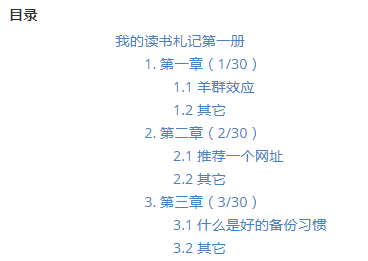


#### 11. 锚点

##### 11.1 代码
```
### 0. 目录{#index}
跳转到[目录](#index)
```

##### 11.2 效果
> 不支持，不做展示


#### 12. 数学公式（Latex）

##### 12.1 行内公式
> 语法说明：`$-公式`

###### 12.1.1 代码
```
质能守恒方程可以用一个很简洁的方程式 $E=mc^2$ 来表达。
```

###### 12.1.2 效果


##### 12.2 整行公式
> 语法说明：`$$-公式`

###### 12.2.1 代码-1
```latex
$$\sum_{i=1}^n a_i=0$$

$$f(x_1,x_x,\ldots,x_n) = x_1^2 + x_2^2 + \cdots + x_n^2 $$

$$\sum^{j-1}_{k=0}{\widehat{\gamma}_{kj} z_k}$$
```

###### 12.2.2 效果-1
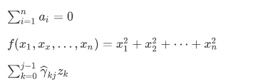

###### 12.2.3 代码-1
```latex
$$
\left[
\begin{matrix}
 1      & 2      & \cdots & 4      \\
 7      & 6      & \cdots & 5      \\
 \vdots & \vdots & \ddots & \vdots \\
 8      & 9      & \cdots & 0      \\
\end{matrix}
\right]
$$
```

###### 12.2.4 效果-2
$$
\left[
\begin{matrix}
 1      & 2      & \cdots & 4      \\
 7      & 6      & \cdots & 5      \\
 \vdots & \vdots & \ddots & \vdots \\
 8      & 9      & \cdots & 0      \\
\end{matrix}
\right]
$$


##### 12.3 公式参考：[MathJax](https://math.meta.stackexchange.com/questions/5020/mathjax-basic-tutorial-and-quick-reference "MathJax basic tutorial and quick reference")

#### 13. 代码嵌入

##### 13.1 行内嵌入
> 语法说明：“`需要嵌入的代码`”

###### 13.1.1 代码
```Python
Python 语言里的函数 `printf()` 怎么使用？
```

###### 13.1.2 效果
Python 语言里的函数 `printf()` 怎么使用？


##### 13.2 缩进式多行代码
> 语法说明：`缩进 8 个空格或是 2 个制表符`。

###### 13.2.1 代码
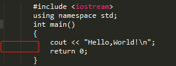

###### 13.2.2 效果
       #include <iostream>
       using namespace std;
       int main()
       {
           cout << "Hello,World!\n";
           return 0;
       }


##### 13.3 前后各 3 个 “`” 包含代码块

###### 13.3.1 代码
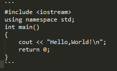

###### 13.3.2 效果
```
#include <iostream>
using namespace std;
int main()
{
    cout << "Hello,World!\n";
    return 0;
}
```

##### 13.4 代码高亮
> 语法说明：在 前三个 “`” 后写上语言的名称。

###### 13.4.1 代码
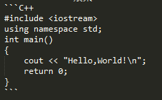

###### 13.4.2 效果
```C++
#include <iostream>
using namespace std;
int main()
{
    cout << "Hello,World!\n";
    return 0;
}
```

#### 14. HTML代码使用

##### 14.1 一般使用

###### 14.1.1 代码
```
<div class="footer">
   © 2004 Foo Corporation
</div>
```

###### 14.1.2 效果


##### 14.2 颜色使用

###### 14.2.1 代码
```html
<font face="黑体">我是黑体字</font>
<font face="微软雅黑">我是微软雅黑</font>
<font face="STCAIYUN">我是华文彩云</font>
<font color=#0099ff size=4 face="黑体">color=#0099ff size=72 face="黑体"</font>
<font color=#00ffff size=3>color=#00ffff</font>
<div style="background:#000000; color:#FFF" size=2>背景为黑色</div>

颜色使用
> 一级分类
<font color="#FF0000" size=4>红 01. 要事</font>  <font color="#6495ED" size=4>蓝 02. 工作</font>
<font color="#32CD32" size=4>绿 03. 私事</font>  <font color="#000000" size=4>黑 04. 琐事</font>
> 二级分类
>> 健康
<font color="#00CED1" size=4>青 05. 健康</font>
>> 社交
<font color="#FFD700" size=4>黄 06. 社交</font>
>> 娱乐
<font color="#8B4513" size=4>棕 07. 有趣</font> <font color="#C0C0C0" size=4>灰 08. 娱乐 </font>
<font color="#D3D3D3" size=4>白 09. 音乐</font>
>> 提升
<font color="#FFB6C1" size=4>粉 10. 学习</font> <font color="#9370D8" size=4>紫 11. 技能</font>
<font color="#FFA500" size=4>橙 12. 知识</font>
```

###### 14.2.1 效果

<font face="黑体">我是黑体字</font>
<font face="微软雅黑">我是微软雅黑</font>
<font face="STCAIYUN">我是华文彩云</font>
<font color=#0099ff size=4 face="黑体">color=#0099ff size=72 face="黑体"</font>
<font color=#00ffff size=3>color=#00ffff</font>
<div style="background:#000000; color:#FFF" size=2>背景为黑色</div>
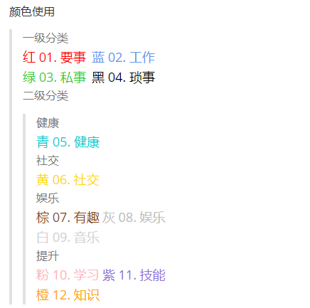

##### 14.3 表格使用
###### 14.3.1 代码
```
<table>
  <thead>
      <tr>
         <th style="width: 60px;">日期</th>
         <th style="width: 120px;">星期</th>
         <th style="width: 180px;">经验</th>
         <th style="width: 250px;">教训</th>
      </tr>
  </thead>
  <tbody>
    <tr>
        <th rowspan="2" style="width: 120px;">我占了三行</th>
        <th>第一列</th>
        <th>第二列</th>
        <th>第三列</th>
    </tr>
    <tr>
        <td>第一列</td>
        <td>第二列</td>
        <td>第三列</td>
    </tr>
    <tr>
        <td colspan="2" >第一列</td>
        <td>第二列</td>
        <td>第三列</td>
    </tr>
  </tbody>
</table>
```

###### 14.3.2 效果-2
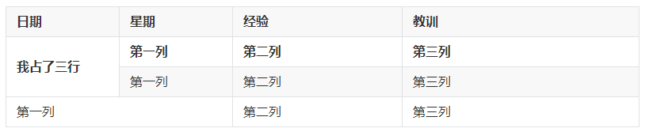


#### 15. 流程图（[参考手册](http://flowchart.js.org/)）
##### 15.1 代码
```
三个点开始-flow

st=>start: Start|past:>http://www.google.com[blank]
e=>end: End:>http://www.google.com
op1=>operation: My Operation|past
op2=>operation: Stuff|current
sub1=>subroutine: My Subroutine|invalid
cond=>condition: Yes
or No?|approved:>http://www.baidu.com
c2=>condition: Good idea|rejected
io=>inputoutput: catch something...|request

st->op1(right)->cond
cond(yes, right)->c2
cond(no)->sub1(left)->op1
c2(yes)->io->e
c2(no)->op2->e

三个点结束
```

##### 15.2 代码图示
> 上面代码所说的 三个点开始- 和 三个点结束，实际写的时候如下

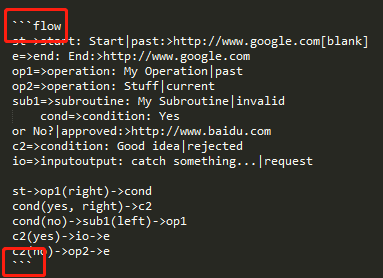

##### 15.2 效果
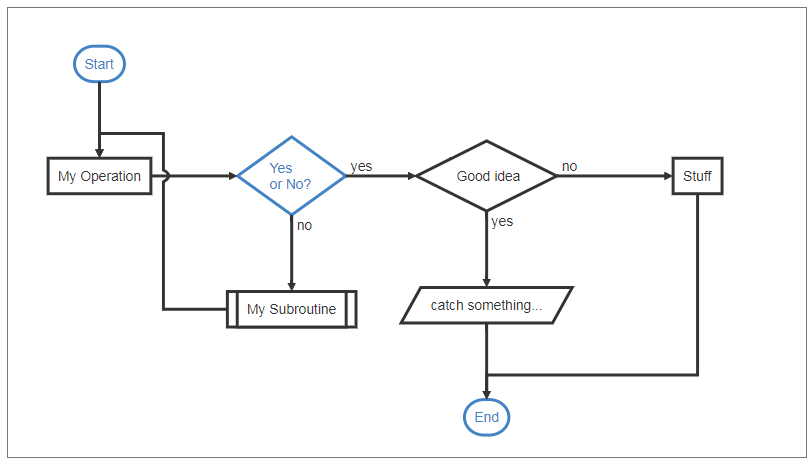

#### 16. 序列图（[参考手册](https://bramp.github.io/js-sequence-diagrams/)）
##### 16.1 代码
```
三个点开始-sequence

Andrew->China: Says Hello
Note right of China: China thinks\nabout it
China-->Andrew: How are you?
Andrew->>China: I am good thanks!

三个点结束
```

##### 16.2 效果
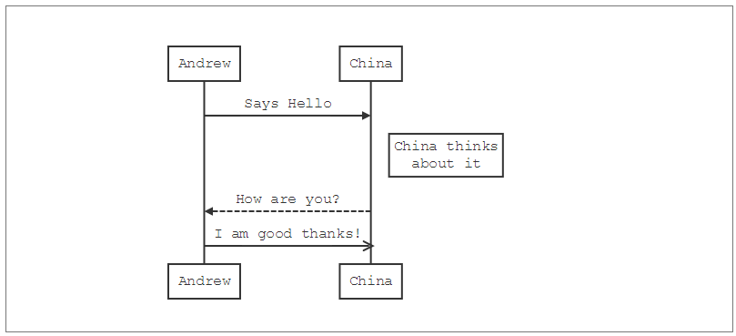


#### 17. Mermaid 图集（[参考手册](https://mermaidjs.github.io/)）

##### 17.1 Mermaid 序列图
###### 17.1.1 代码

```
三个点开始-mermaid
sequenceDiagram

participant 张三
participant 李四

张三->王五: 王五你好吗？

loop 健康检查
    王五->王五: 与疾病战斗
end

Note right of 王五: 合理 食物 <br/>看医生...
李四-->>张三: 很好!
王五->李四: 你怎么样?
李四-->王五: 很好!

三个点结束
```

###### 17.1.2 效果
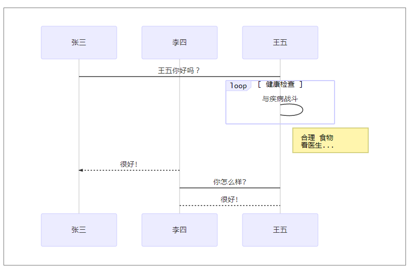


##### 17.2 Mermaid 横向流程图
###### 17.2.1 代码
```
三个点开始-mermaid
graph LR

A[方形] -->B(圆角)
B --> C{条件a}
C -->|a=1| D[结果1]
C -->|a=2| E[结果2]
F[横向流程图]

三个点结束
```

###### 17.2.2 效果
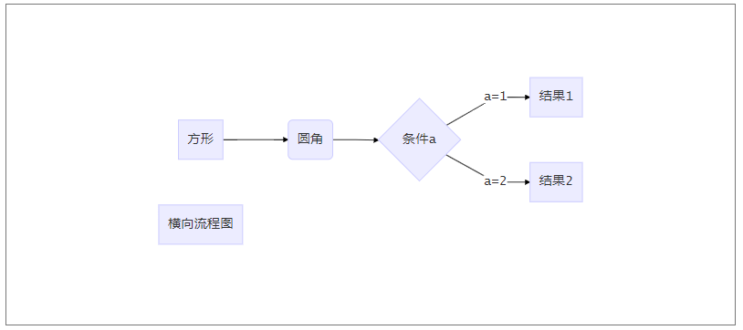


##### 17.3 Mermaid 纵向流程图
###### 17.3.1 代码
```
三个点开始-mermaid
graph TD

client1-->|read / write|SVN((SVN server))
client2-->|read only|SVN
client3-->|read / write|SVN
client4-->|read only|SVN
client5(...)-->SVN
SVN---|store the data|sharedrive

三个点结束
```


###### 17.3.2 效果
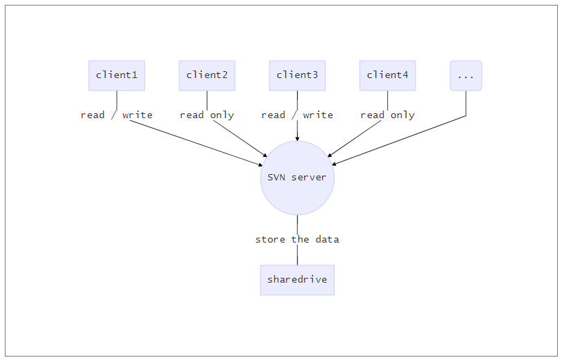

##### 17.4 Mermaid 甘特图
###### 17.4.1 代码
```
三个点开始-mermaid
gantt

dateFormat  YYYY-MM-DD
title 软件开发甘特图
section 设计
        需求              :done, des1, 2014-01-06,2014-01-08
        原型              :active, des2, 2014-01-09, 3d
        UI设计            :des3, after des2, 5d
        未来任务          :des4, after des3, 5d

section 开发
        学习准备理解需求  :crit, done, 2014-01-06,24h
        设计框架          :crit, done, after des2, 2d
        开发              :crit, active, 3d
        未来任务          :crit, 5d
        耍                :2d

section 测试
        功能测试          :active, a1, after des3, 3d
        压力测试          :after a1, 20h
        测试报告          :48h

三个点结束
```

###### 17.4.2 效果
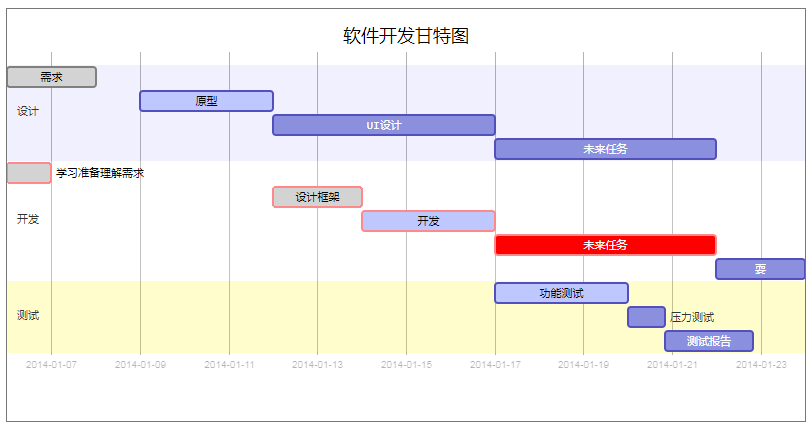


#### 18. 待办事宜 Todo 列表
##### 18.1 代码
```
- [ ] **小专栏 Markdown 编辑器开发**
    - [ ] 增加 TOC 语法
    - [ ] 增加流程图、序列图、甘特图、Todo 列表
    - [x] 新增Todo列表功能 [语法参考](https://github.com/blog/1375-task-lists-in-gfm-issues-pulls-comments)
    - [x] 改进 LaTex 功能
      ​    - [x] 修复 LaTex 公式渲染问题
      ​    - [x] 新增 LaTex 公式编号功能 [语法参考](http://docs.mathjax.org/en/latest/tex.html#tex-eq-numbers)
- [ ] **最近小专栏推广**
    - [x] 微信公众号广告投放
    - [ ] 二月份小专栏微信服务号文章准备
    - [ ] 邀请更多技术牛人到小专栏写作
```

##### 18.2 效果
- [ ] **小专栏 Markdown 编辑器开发**
    - [ ] 增加 TOC 语法
    - [ ] 增加流程图、序列图、甘特图、Todo 列表
    - [x] 新增Todo列表功能 [语法参考](https://github.com/blog/1375-task-lists-in-gfm-issues-pulls-comments)
    - [x] 改进 LaTex 功能
      ​    - [x] 修复 LaTex 公式渲染问题
      ​    - [x] 新增 LaTex 公式编号功能 [语法参考](http://docs.mathjax.org/en/latest/tex.html#tex-eq-numbers)
- [ ] **最近小专栏推广**
    - [x] 微信公众号广告投放
    - [ ] 二月份小专栏微信服务号文章准备
    - [ ] 邀请更多技术牛人到小专栏写作


#### 19. Note Tag 测试
>  Hexo 的 Theme-next 主题相关功能  [NexT Theme for Hexo -- Note Tag](https://theme-next.org/docs/tag-plugins/note)

```
/**
 * note.js | global hexo script.
 *
 * ATTENTION!
 *  No need to write this tag in 1 line if u don't want see probally bugs.
 *
 * Usage:
 *
 * 
 * Any content (support inline tags too).
 * 
 *
 * [class] : default | primary | success | info | warning | danger.
 *           May be not defined.
 */
```


##### Test note danger
路漫漫其修远兮，吾将上下而求索。



##### Test note success
路漫漫其修远兮，吾将上下而求索。


#### 20. 特殊符号处理
Markdown 使用反斜杠 \ 插入语法中用到的特殊符号。在 Markdown 中，主要有以下几种特殊符号需要处理：
```
\ 反斜线
` 反引号
* 星号
_ 底线
{} 花括号
[] 方括号
() 括弧
# 井字号
+ 加号
- 减号
. 英文句点
! 惊叹号
```

#### 21. 更多功能（TO Be continue！！！）

---

#### 版本更新记录
* v.1.0 2017-06-19 初始化；
* v.1.1 2018-08-05 增加 9 到 10 章节内容；
* v.2.0 2018-10-19 增加 11 到 18 内容；
* v.2.1 2019-08-12 增加 19 部分内容；
* v.2.2 2020-08-04 增加 20 部分内容。
